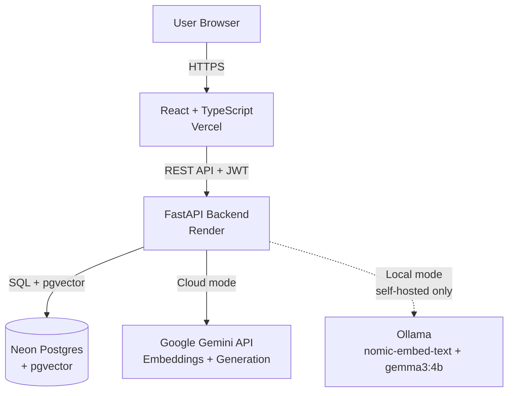

# Document Q&A (RAG-based)

A full-stack, multi-user RAG (Retrieval-Augmented Generation) application that lets users upload PDFs and ask natural-language questions grounded in their content — with persistent accounts, conversation history, and a choice between cloud (Gemini) or fully local (Ollama) processing for privacy.

**Live demo:** [document-qa-rag-tau.vercel.app](https://document-qa-rag-tau.vercel.app)


## Features

- **Multi-document RAG** — upload multiple PDFs, ask questions grounded in their content, with page-level citations for every answer
- **Multi-turn conversation memory** — follow-up questions are automatically reformulated using conversation history before retrieval, so context carries across a chat
- **Dual AI pipelines** — Cloud mode (Google Gemini) for speed, or Local mode (Ollama, running `nomic-embed-text` + `gemma3:4b`) for users who want their documents to never leave their machine — fully separate embedding spaces and vector storage per mode
- **User accounts** — JWT-based authentication, with all documents and conversations scoped per user
- **Persistent chat history** — multiple named conversations per user, with pin, rename, and delete
- **Production-grade persistence** — Postgres (via Neon) with the `pgvector` extension for vector similarity search, replacing an earlier local ChromaDB implementation that didn't survive redeploys
- **Automated testing & CI** — a pytest suite covering auth, business logic, and the core upload/ask flow (with AI calls mocked for speed and determinism), running automatically on every push via GitHub Actions

## Architecture



**Note on Local mode:** since the backend runs on Render, its `localhost` refers to Render's own server, not a visitor's machine — so Local mode only works when this project is cloned and run on your own computer, where Ollama is actually reachable. The deployed site automatically disables the toggle and explains why, rather than allowing it to fail silently.

## Tech Stack

| Layer | Technology |
|---|---|
| Frontend | React, TypeScript, Tailwind CSS |
| Backend | FastAPI (Python) |
| Database | Neon (Postgres) + pgvector |
| AI (Cloud) | Google Gemini (embeddings + generation) |
| AI (Local) | Ollama (`nomic-embed-text`, `gemma3:4b`) |
| Auth | JWT (PyJWT + bcrypt) |
| Testing | pytest, GitHub Actions CI |
| Deployment | Render (backend), Vercel (frontend) |

## How it works

1. A user uploads a PDF, which is split into page-aware chunks
2. Each chunk is embedded (via Gemini or Ollama, depending on mode) and stored in Postgres with the user's ID, filename, and page number
3. When a question is asked, follow-up questions are first reformulated using recent conversation history if needed
4. The question is embedded and compared against the user's stored chunks using pgvector's cosine distance search
5. The most relevant chunks are passed to the LLM as context, which generates an answer grounded strictly in the retrieved content — explicitly avoiding hallucinated answers when the documents don't contain the information

## Running locally

**Backend:**
```bash
cd backend
python -m venv venv
venv\Scripts\activate
pip install -r requirements.txt
```
Create a `.env` file with `GEMINI_API_KEY`, `DATABASE_URL`, and `JWT_SECRET_KEY`, then:
```bash
python schema.py
uvicorn main:app --reload
```

**Frontend:**
```bash
cd frontend
npm install
npm run dev
```

**Running tests:**
```bash
cd backend
pytest tests/ -v
```

## Known limitations

- Local mode requires Ollama installed and running on your own machine — not available on the deployed demo
- Neon's free tier scales to zero when idle (auto-wakes within ~1 second on the next request, no manual action needed)